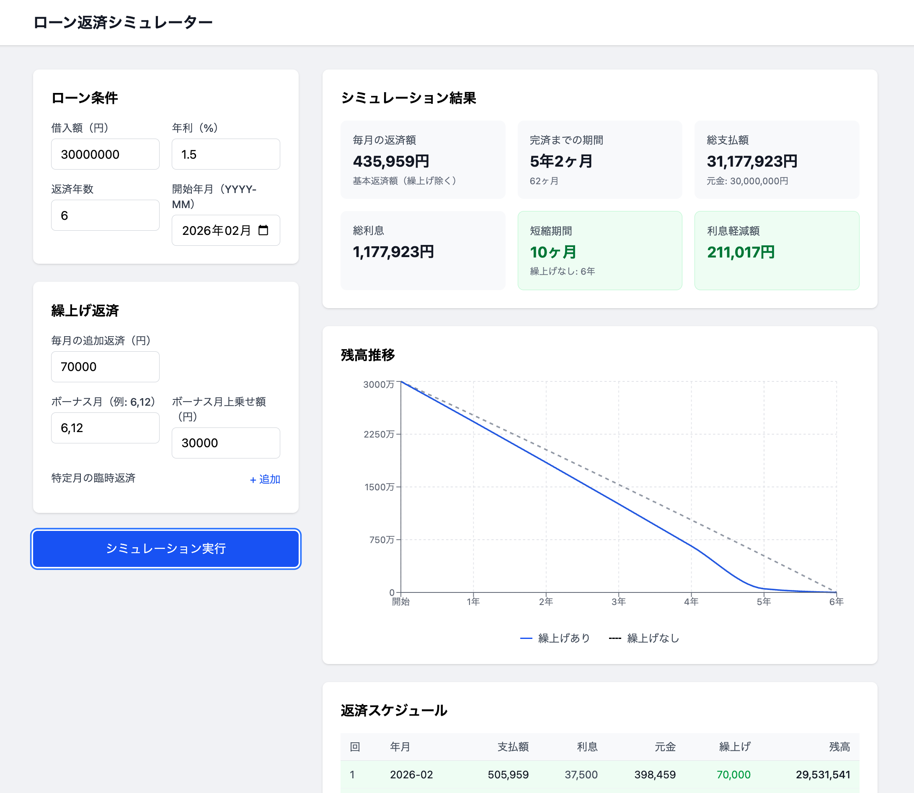

# Loan Simulator

住宅,車,カードローンなどの返済シミュレーションツール。繰上げ返済による期間短縮・利息軽減効果を可視化できる。

## Features



- **元利均等返済** のシミュレーション
- **繰上げ返済（期間短縮型）** の効果計算
  - 毎月追加返済
  - ボーナス月の上乗せ
  - 特定月の臨時返済
- 返済スケジュール表
- 残高推移グラフ（繰上げあり/なしの比較）

## Tech Stack

- React 19 + TypeScript
- Vite 7
- Tailwind CSS 4
- Recharts（グラフ）
- Vitest（テスト）

## Getting Started

```bash
cd app
npm install
npm run dev
```

http://localhost:5173 で起動する。

## Commands

```bash
cd app

npm run dev          # 開発サーバー起動
npm run build        # プロダクションビルド
npm run lint         # ESLint 実行
npm run test         # テスト（watch モード）
npm run test:run     # テスト（単発実行）
npm run test:coverage # カバレッジ付きテスト
```

## Project Structure

```
app/
├── src/
│   ├── domain/       # ドメインロジック（返済計算、バリデーション）
│   ├── components/   # UI コンポーネント
│   └── App.tsx       # メインアプリケーション
```

## License

MIT
